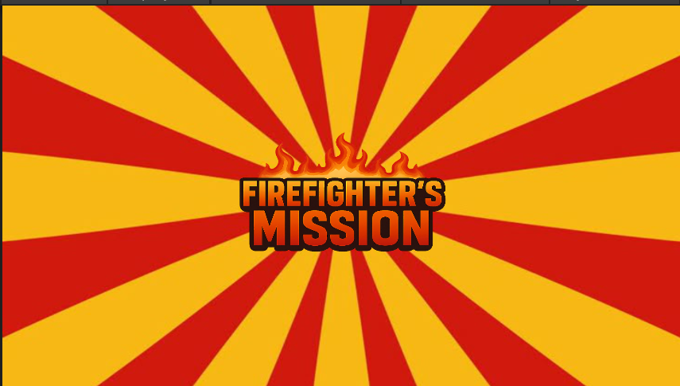
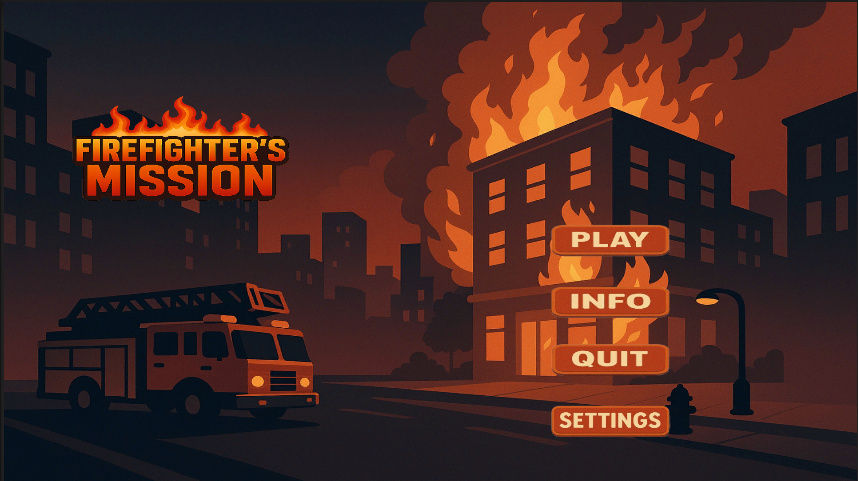
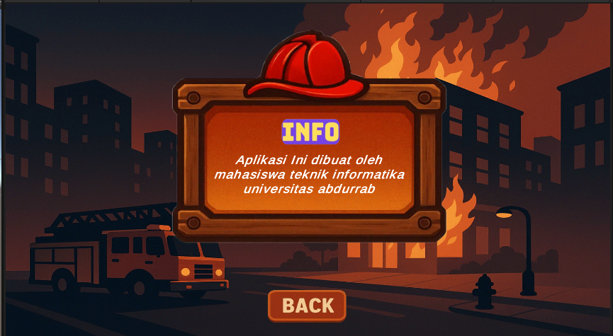
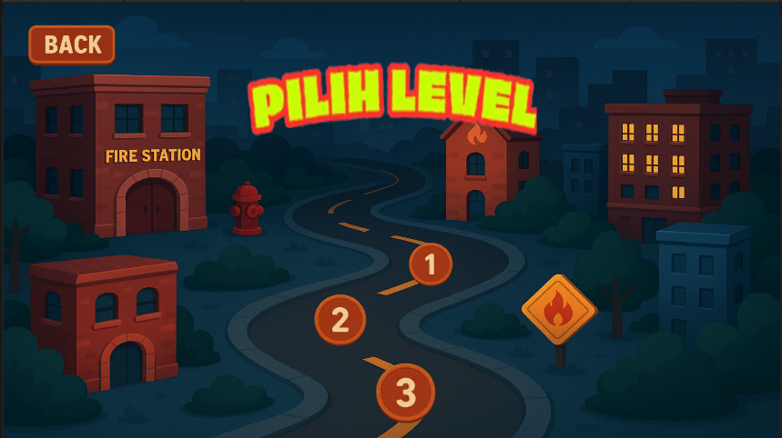
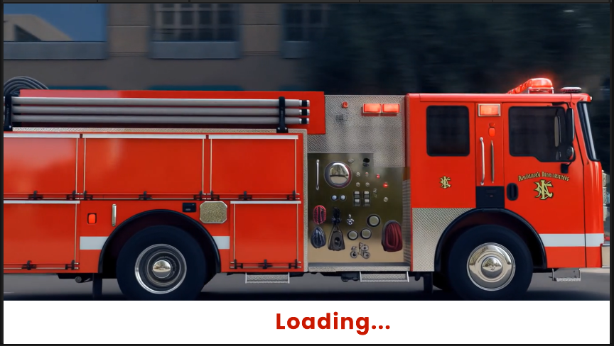
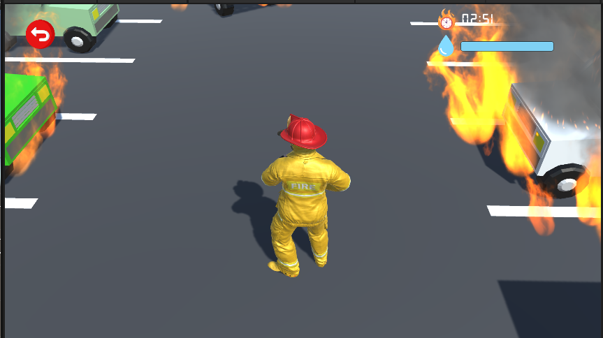
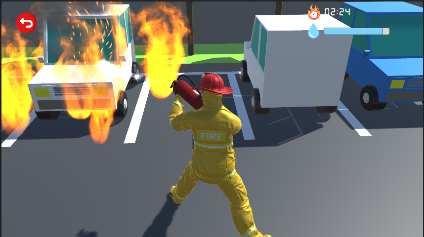
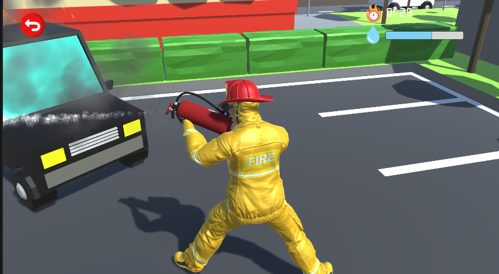
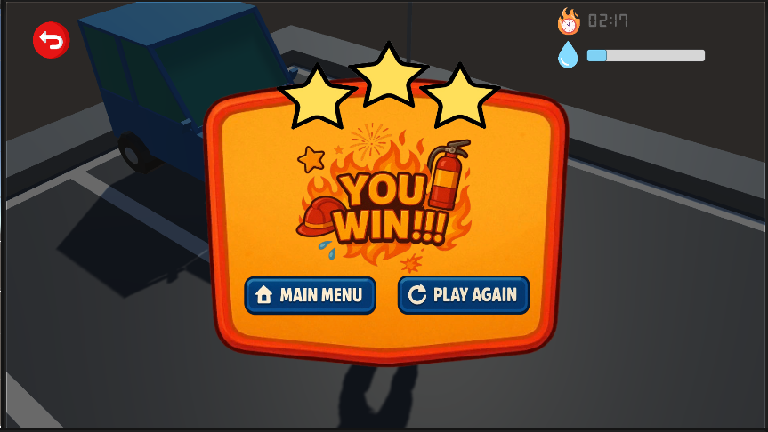
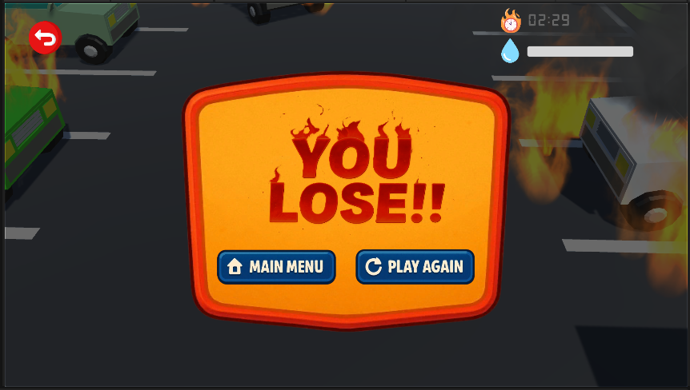

# 📘 Fire Fighters Game

Deskripsi singkat tentang aplikasi. Misalnya:

> Aplikasi ini merupakan game pemadam kebakaran, dimana player dapat mengontrol karakter untuk memadamkan api. jika api sudah padam semua akan muncul tampilan menang dan bintang, jika api belum padam dan waktu atau stokk air sudah habis maka akn muncul tampilan kalah

---

## 🚀 Fitur Utama

- 📋 Kontrol Pemain
- 📋 Memadamkan Api
- 📋 Tampilan UI: Timer, Stock Water, dan Win serta Lose
- 📋 Api yang menyala
- 📋 Bangungan low poly
- 📋 Setting sound

---

## 📸 Tampilan Setiap Halaman

### 1. Loading Awal



### 2. Main Menu



### 3. Setting Sound


### 4. Setting Info



### 5. Menu Level



### 6. Loading Game



### 7. Start Game



### 8. Api



### 9. Water



### 10. UI Win



### 11. UI Lose



---

## 💻 Cara Instalasi

```bash
git clone https://github.com/username/nama-proyek.git
cd nama-proyek
gunakan unity versi versi 2022.3.10f1 (atau versi yang sesuai dengan ProjectVersion.txt)
buka unity hub
klik Add Project, lalu arahkan ke folder clone
lalu jalankan
```
